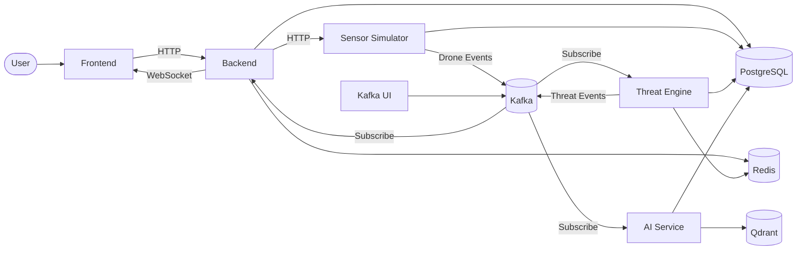

# IronVeil


   

**A real-time ISR (Intelligence, Surveillance, and Reconnaissance) platform for drone threat detection, assessment, and AI-assisted intelligence.**

<!--
DEMO GIF

-->

## What is this?

This project simulates a real-time drone monitoring pipeline. A sensor simulator generates drone events with information like the drone ID, location, speed, altitude, and heading, similar to what a surveillance system might detect.

Each event generated by sensor-simulator is published to Kafka, where it is processed by a threat engine that analyzes the data and assigns a threat score. The analyzed events are then sent back through Kafka to the backend, which pushes live updates to the frontend using WebSockets. An AI service also generates a short summary for each threat to make the information easier to understand at a glance.

This isn't a real defense or military application. It's a personal project built to learn and experiment with distributed systems, event-driven architecture, Kafka, WebSockets, AI integration and anything I want to practice and learn. It's open source, still a work in progress, and something I'll continue to improve as I learn new technologies.

## Key Features

- Real-time dashboard Live threat updates, counters, and activity feed delivered over WebSockets without polling.
- Event-driven pipeline Drone events flow through Kafka from the sensor simulator to the threat engine and backend.
- Threat analysis engine Assigns a threat score based on the incoming drone telemetry.
- AI-generated summaries Generates short, human-readable summaries for significant threats.
- Interactive operations map Displays live drone locations, movement, and restricted zones.
- Role-based access control Three user roles with permissions enforced in both the frontend and backend.
- Semantic incident search Uses Qdrant vector search to find similar historical incidents.
- Observability Prometheus metrics and Grafana dashboards for monitoring the system.
- Docker Compose deployment Starts the entire platform with a single docker compose up command.

## Tech Stack

Layer | Technology
:-:|:-
Frontend | React 19, Vite, TypeScript, Tailwind CSS v4, React Router, TanStack Query, MapLibre GL JS, shadcn/ui
Backend | Fastify, TypeScript, WebSockets, JWT Authentication
Services | Sensor Simulator, Threat Engine, AI Service
Messaging | Apache Kafka, KafkaJS
Databases | PostgreSQL, Redis, Qdrant
AI | Google Gemini
DevOps | Docker, Docker Compose, Flyway
Observablity | Prometheus, Grafana
Testing | Vitest, React Testing Library, Playwright
Tooling | pnpm Workspaces, TypeScript, TSX

## Quick Start

### Prerequisites

#### Development

- Docker Desktop (latest recommended)
- Node.js 24+
- A Google Gemini API key (used for AI summaries and embeddings)

Update Corepack first:

```bash
npm install -g corepack@latest
```

> Due to an issue with outdated signatures in Corepack, it's recommended to update it before enabling pnpm.

Enable pnpm:

```bash
corepack enable pnpm
```

#### Production

- Docker Desktop (latest recommended)
- A Google Gemini API key

---

### Installation (Development)

```bash
# 1. Clone the repository
git clone https://github.com/arjunjayan999/ironveil.git
cd ironveil

# 2. Install dependencies
pnpm install

# 3. Copy environment files
# Copy each service's .env.example to .env

apps/backend/.env.example           -> apps/backend/.env
apps/frontend/.env.example          -> apps/frontend/.env
apps/threat-engine/.env.example     -> apps/threat-engine/.env
apps/sensor-simulator/.env.example  -> apps/sensor-simulator/.env
apps/ai-service/.env.example        -> apps/ai-service/.env

# Command for copying .envs on Linux / macOS / WSL
find apps -type f -name ".env.example" -exec sh -c 'cp "$1" "${1%.example}"' _ {} \;

# Command for copying .envs on Windows (PowerShell)
Get-ChildItem apps -Filter ".env.example" -Recurse | ForEach-Object {
    Copy-Item $_.FullName $_.FullName.Replace(".example", "")
}

# 4. Start the infrastructure
docker compose -f infrastructure/docker/docker-compose.dev.yml up -d

# 5. Start all services
pnpm dev
```

Open:

```
http://localhost:5173
```

The first startup may take a few minutes while Docker images are pulled and dependencies are installed. Subsequent startups are much faster.

If everything is running correctly, you should see the login page.

To stop the application:

```bash
# Stop all Node.js services
Ctrl + C

# Stop Docker containers
docker compose -f infrastructure/docker/docker-compose.dev.yml down
```

---

### Installation (Production)

```bash
# 1. Clone the repository
git clone https://github.com/arjunjayan999/ironveil.git
cd ironveil

# 2. Copy the root environment file

# Command for copying .env on Linux / macOS / WSL
cp .env.example .env

# Command for copying .env on Windows (Powershell)
Copy-Item .env.example .env

# 3. Update the values in .env
# (especially your Gemini API key and any production configuration)

# 4. Start the full stack
docker compose -f infrastructure/docker/docker-compose.yml up -d
```

Open:

```
http://localhost
```

The first startup may take a few minutes while Docker builds and initializes the services. After everything is ready, you should see the login page.

To stop the application:

```bash
docker compose -f infrastructure/docker/docker-compose.yml down
```

## Demo Credentials

<!--
Table of seed user and its password, so a visitor can immediately log in
and explore without setting anything up themselves.
Seed script needs to be written
-->

Username | Password
---|---
|

## Architecture

IronVeil follows an event-driven architecture. Users interact with the Frontend, which sends an HTTP request to the Backend to start the simulation. The Backend then sends an HTTP request to the Sensor Simulator, which begins publishing drone events to the drone-events Kafka topic. The Threat Engine subscribes to this topic, consumes the events, performs rule-based threat analysis, and publishes the results to the threat-events topic. The Backend subscribes to threat-events and streams real-time updates to the Frontend via WebSockets.
The AI Service also subscribes to the threat-events topic, where it generates threat summaries using the Google GenAI SDK and Gemini API. These summaries are stored in Qdrant for semantic retrieval. PostgreSQL is shared by all backend services except the Frontend, while Redis is used by the Backend and Threat Engine for caching and state management.



For a detailed breakdown of the system architecture, event flow, service responsibilities, and design decisions, see **[`docs/ARCHITECTURE.md`](docs/ARCHITECTURE.md)**.

## Documentation

| Document | Description |
|---|---|
| [ARCHITECTURE.md](docs/ARCHITECTURE.md) | System architecture, service responsibilities, event flow, and design decisions. |
| [API_REFERENCE.md](docs/API_REFERENCE.md) | REST API endpoints, WebSocket events, authentication, and request/response examples. |
| [DEPLOYMENT.md](docs/DEPLOYMENT.md) | Development and production deployment guides, environment variables, and infrastructure setup. |
| [SECURITY.md](docs/SECURITY.md) | Authentication, authorization, security considerations, and best practices. |
| [ROADMAP.md](docs/ROADMAP.md) | Planned features, future improvements, and project milestones. |

## Running Tests

```bash
pnpm test
```

## Contributing

Contributions are welcome, whether it's fixing bugs, improving documentation, or adding new features. If you'd like to get involved.

See [`CONTRIBUTING.md`](CONTRIBUTING.md) for development setup and PR guidelines.

## License

[](LICENSE)

This project is licensed under the Apache License 2.0. See the [LICENSE](LICENSE) file for details.
