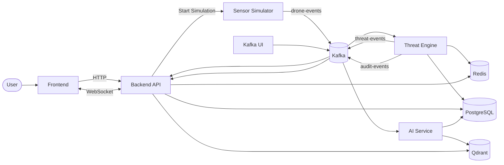
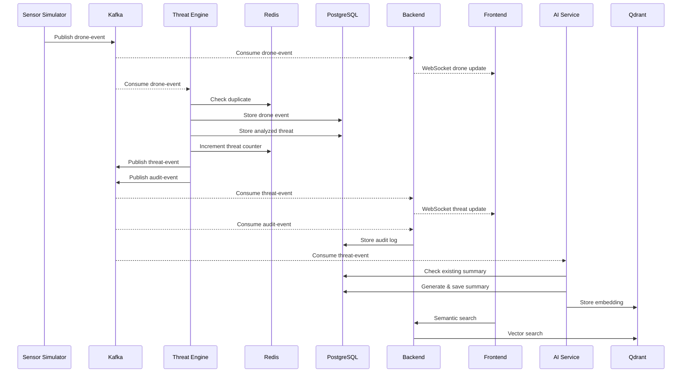

# Architecture

## System Overview

This project is an event-driven microservices system designed to simulate drone activity, perform real-time threat analysis, and provide AI-powered threat summaries with semantic search capabilities. Instead of tightly coupling services through synchronous HTTP calls, most communication happens asynchronously through Kafka, allowing individual services to operate independently and process events at their own pace.

The system consists of five application services: the Frontend, Backend API, Threat Engine, Sensor Simulator, and AI Service. These services are supported by PostgreSQL for persistent storage, Redis for caching and idempotency, Kafka for event streaming, Qdrant for vector search, and Kafka UI for monitoring the event pipeline. Users interact only with the Frontend, while the remaining services communicate through HTTP, WebSockets, and Kafka depending on the use case.

## Diagram

### Event Processing Flow

## Services

### Frontend

**Responsibility**

The Frontend provides the user interface for interacting with the system. It starts the sensor simulation, displays live drone activity, shows threat analysis results, and allows semantic searching of AI-generated summaries.

**Consumes / Produces**

Consumes:
- HTTP APIs exposed by the Backend
- WebSocket events for live drone events, threats, and metrics

Produces:
- User actions through HTTP requests
- Search requests for semantic search

**Failure Impact**

If the Frontend is unavailable, users lose access to the application, but the backend services continue processing events normally. Kafka pipelines, threat analysis, AI summarization, and data persistence remain unaffected.

---

### Backend API

**Responsibility**

The Backend acts as the main gateway between users and the rest of the system. It exposes HTTP APIs, manages WebSocket connections, consumes Kafka events, persists audit logs, retrieves live metrics, and provides semantic search endpoints.

**Consumes / Produces**

Consumes:
- HTTP requests from the Frontend
- Kafka `drone-events`
- Kafka `threat-events`
- Kafka `audit-events`
- Redis cached metrics
- PostgreSQL data
- Qdrant search results

Produces:
- HTTP responses
- WebSocket broadcasts
- Audit records stored in PostgreSQL

**Failure Impact**

If the Backend becomes unavailable, users cannot interact with the application or receive real-time updates. However, the Sensor Simulator, Threat Engine, AI Service, and Kafka continue processing events independently, allowing the system to recover without losing event history.

---

### Threat Engine

**Responsibility**

The Threat Engine is responsible for all threat analysis. It validates event uniqueness, calculates threat scores using predefined business rules, stores results, updates live metrics, and publishes analyzed events for downstream consumers.

**Consumes / Produces**

Consumes:
- Kafka `drone-events`
- Redis duplicate tracking
- PostgreSQL

Produces:
- Threat records in PostgreSQL
- Updated Redis metrics
- Kafka `threat-events`
- Kafka `audit-events`

**Failure Impact**

If the Threat Engine stops, drone events continue to be generated and consumed by the Backend for visualization, but no threat analysis is performed. AI summaries are not generated because no new threat events are published.

---

### Sensor Simulator

**Responsibility**

The Sensor Simulator generates simulated drone events to emulate incoming sensor data without requiring physical hardware.

**Consumes / Produces**

Consumes:
- HTTP request from the Backend to start simulation

Produces:
- Kafka `drone-events`

**Failure Impact**

If the simulator is unavailable, no new drone events are produced. Existing data remains accessible, but no additional threats or AI summaries are generated.

---

### AI Service

**Responsibility**

The AI Service generates natural language summaries for analyzed threats and creates vector embeddings that enable semantic search.

**Consumes /Produces**

Consumes:
- Kafka `threat-events`
- PostgreSQL threat and drone data

Produces:
- Threat summaries stored in PostgreSQL
- Embeddings stored in Qdrant

**Failure Impact**

If the AI Service is unavailable, threat detection continues normally. The only missing functionality is AI-generated summaries and semantic search for newly analyzed threats.

---

## Data Flow: A Single Threat, End to End

1. A user starts the Sensor Simulator through the Frontend.
2. The Backend receives the HTTP request and starts the Sensor Simulator.
3. The Sensor Simulator continuously generates drone events and publishes them to the `drone-events` Kafka topic.
4. The Backend consumes each drone event and immediately broadcasts it to connected Frontend clients over WebSockets for live visualization.
5. The Threat Engine independently consumes the same `drone-events` message.
6. The Threat Engine checks Redis to determine whether the event has already been processed.
7. If the event is new, it stores the raw drone event in PostgreSQL.
8. The Threat Engine evaluates the event using its rule-based scoring engine and calculates the Threat Score, Threat Level, and Score Breakdown.
9. The analyzed threat is stored in PostgreSQL.
10. The Threat Engine increments the live threat counter in Redis.
11. The Threat Engine publishes the analyzed result to the `threat-events` topic.
12. The Threat Engine also publishes an audit record to the `audit-events` topic.
13. The Backend consumes the `threat-events` topic and broadcasts the analyzed threat to all connected Frontend clients through WebSockets.
14. The Backend consumes the `audit-events` topic and stores audit information in PostgreSQL.
15. The AI Service consumes the `threat-events` topic.
16. The AI Service checks whether a summary already exists for the threat.
17. If no summary exists, it retrieves the associated drone event and analyzed threat from PostgreSQL.
18. A prompt is constructed and sent to Gemini using the Google GenAI SDK.
19. The generated summary is stored in PostgreSQL.
20. The summary embedding is generated and upserted into Qdrant.
21. When a user performs semantic search, the Backend queries Qdrant and returns the most relevant threat summaries.

## Why These Technology Choices

### Kafka instead of direct HTTP communication

Kafka decouples producers from consumers and allows multiple services to process the same event independently. The Sensor Simulator only needs to publish a drone event once, while the Backend, Threat Engine, and any future services can consume it without additional coordination. Using synchronous HTTP calls would tightly couple services and make failures propagate throughout the system.

### PostgreSQL instead of multiple specialized databases

PostgreSQL serves as the primary source of truth for structured application data. Drone events, analyzed threats, audit logs, and AI summaries all require reliable persistence and relational queries. Keeping this data in a single database simplifies consistency while Redis and Qdrant handle specialized workloads.

### Redis as a cache rather than a source of truth

Redis is used only for temporary or derived data such as processed event tracking and live threat counters. If Redis is cleared, the system can rebuild its state from PostgreSQL, making Redis an optimization rather than a dependency for correctness.

### Event-driven threat processing

Threat analysis is intentionally separated from the Backend into its own service. This keeps the request path lightweight and allows threat processing to evolve independently without affecting user-facing APIs. It also makes adding additional event consumers straightforward.

### WebSockets for live updates

HTTP works well for request-response interactions, but continuously polling for new threats would introduce unnecessary latency and load. A persistent WebSocket connection allows the Backend to push drone events and threat updates to connected clients as soon as they are processed.

### Rule-based threat engine

The threat scoring system is implemented using predefined rules instead of machine learning. This keeps scoring deterministic, easy to debug, and straightforward to modify during development while still demonstrating an event processing pipeline.

### Qdrant for semantic search

Traditional SQL search relies on keyword matching, which is not ideal for natural language queries. Qdrant enables similarity search over embeddings generated from AI summaries, allowing users to search by meaning rather than exact text. Although PostgreSQL with pgvector would also work, using Qdrant keeps vector search isolated from the transactional database and reflects a dedicated vector database architecture.

## Known Limitations / What's Not Production-Ready

- The system uses a single Kafka broker without replication or high availability.
- Kafka topics are automatically created instead of being provisioned through infrastructure scripts.
- Kafka consumers inside the Backend handle both persistence and WebSocket broadcasting. These responsibilities should be separated for better scalability.
- Services currently run as single instances and are not horizontally scalable.
- The Sensor Simulator is configured through environment variables. Simulation parameters should instead be supplied by the Frontend at runtime.
- Authentication uses short-lived JWTs without refresh tokens.
- The AI Service does not implement rate limiting, retry policies, or request batching.
- The threat scoring engine is entirely rule-based and does not incorporate historical analysis or machine learning models.
- Only simulated drone data is supported. No real sensor integration exists.
- A proper PostgreSQL seed script for development environments should be added.
- Test coverage should be significantly improved, especially for Kafka consumers, threat scoring logic, AI workflows, and failure scenarios.
- Error recovery and retry mechanisms are minimal. Failed Kafka messages should eventually be handled through dead-letter queues or retry topics.
- Observability is limited. Production deployments would benefit from centralized logging, distributed tracing, and metrics collection using tools such as Prometheus and Grafana.